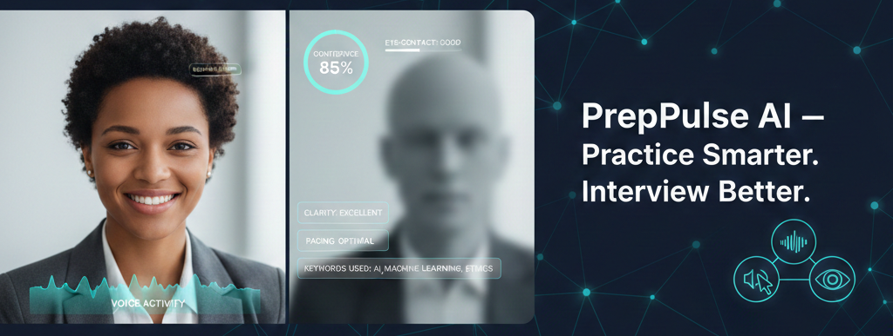

# PrepPulse AI

Important: Team members must follow our Git/GitHub workflow rules in `GITHUB_PROTOCOL_PR_REPO_PROTOCOL.md` before pushing or merging.

## Project Summary
Smart Interview Simulator is a graduation project for DEPI: a cloud-hosted AI mock interview platform that helps software engineering candidates practice interviews and get actionable feedback on:
- Answer quality and technical relevance
- Communication quality (clarity, pace, filler words)
- Visual interview behavior (eye contact proxy, posture stability, engagement)

The MVP is turn-based near-real-time, English-only, and web-first.

## Goals (MVP)
1. Let users run mock interview sessions with camera + mic.
2. Ask technical/behavioral software engineering questions.
3. Analyze each answer using multimodal AI pipelines.
4. Provide per-question feedback and a final interview report.
5. Recommend a practical 7-day improvement plan.

## In Scope (v1)
1. Web app with interview setup, interview room, and report dashboard.
2. Backend APIs for auth, interview lifecycle, analysis, and media.
3. LLM rubric scoring with structured JSON output.
4. Voice metrics extraction and basic vision metrics extraction.
5. Consent flow, privacy controls, and retention policy support.

## Out of Scope (v1)
1. AI avatar/video interviewer generation.
2. Continuous live coaching while the user is speaking.
3. Languages other than English.
4. Multi-provider model routing abstraction.
5. Mobile-first production app.

## Recommended Architecture

### Frontend
- Stack: React + Vite + TypeScript
- Main modules:
  - Auth and profile
  - Interview setup
  - Interview room (camera/mic capture, timer, question display)
  - Feedback dashboard (scores, strengths, weaknesses, action plan)

### Backend
- Stack: Python FastAPI
- Service responsibilities:
  - Session service: interview lifecycle and timing
  - Analysis service: transcript, scoring, voice/vision fusion
  - Report service: final summary and recommendations
  - Media service: upload URLs, storage access, retention workflow
- Async strategy for MVP:
  - FastAPI background tasks first
  - Optional Celery + Redis only if needed

### Cloud Baseline (Azure)
- Hosting: Azure App Service or Azure Container Apps
- Database: Azure PostgreSQL
- Object storage: Azure Blob Storage
- Secrets: Azure Key Vault
- Monitoring: Azure Application Insights

## Core Features and Flow
1. User creates an interview session with role, difficulty, and question count.
2. System presents one interview question at a time (optional TTS).
3. User records answer via camera/mic.
4. System performs:
   - STT transcription
   - LLM rubric scoring
   - Voice signal metrics
   - Vision behavior metrics
5. User receives immediate per-question feedback.
6. At interview end, system generates full report and 7-day practice plan.

## Public API Endpoints
- `POST /api/v1/auth/register`
- `POST /api/v1/auth/login`
- `POST /api/v1/interviews`
- `GET /api/v1/interviews/{interview_id}`
- `POST /api/v1/interviews/{interview_id}/questions/{question_id}/answer`
- `POST /api/v1/interviews/{interview_id}/questions/{question_id}/analyze`
- `GET /api/v1/interviews/{interview_id}/report`
- `POST /api/v1/media/upload-url`
- `GET /api/v1/media/{media_id}`

## Data Contracts
- `InterviewConfig`: role_type, difficulty, question_count, time_limit_sec
- `Question`: id, prompt, category, expected_competencies
- `AnswerPayload`: transcript, audio_url, video_url, started_at, ended_at
- `VoiceMetrics`: wpm, pause_ratio, filler_count, volume_variance
- `VisionMetrics`: gaze_forward_ratio, posture_shift_count, face_visible_ratio
- `ContentScore`: relevance, structure, technical_depth, clarity, confidence
- `FeedbackItem`: strength, weakness, recommendation, priority
- `InterviewReport`: per_question_scores, overall_score, trend, action_plan_7_days

## Scoring Design (v1)
1. Normalize all metrics to 0-100.
2. Weighted final score:
   - Answer quality: 50%
   - Communication/voice: 30%
   - Visual behavior: 20%
3. LLM output must be strict structured JSON.
4. Each weakness must map to at least one concrete recommendation.
5. Final report must include:
   - Top 3 strengths
   - Top 3 improvement areas
   - 7-day practice plan

## Privacy, Consent, and Retention
1. Explicit consent is required before recording starts.
2. Recording indicator must be visible during camera/mic capture.
3. Raw media default retention is 30 days.
4. Users can delete session media immediately.
5. Collect and store minimum required PII only.
6. Encrypt data in transit and at rest.
7. Keep consent and policy acknowledgment logs.

## Testing and Acceptance Criteria

### Functional
1. Session lifecycle works end-to-end.
2. Media upload/retrieval endpoints work correctly.
3. Transcripts persist per answer.
4. Rubric output validation handles malformed model responses.
5. Final report generation includes required sections.

### Edge Cases and Reliability
1. Low-quality mic audio is handled gracefully.
2. No-camera scenario falls back to voice/text evaluation.
3. Network interruptions are handled with clear user status.
4. Silence and long pauses do not break analysis.
5. Missing vision frames do not block final scoring.

### Security and Privacy
1. Unauthorized media access is denied.
2. Consent gating is enforced before recording APIs.
3. Retention cleanup removes expired media.
4. User delete actions remove linked media and references.

### Performance Targets (MVP)
1. Per-answer analysis under 10 seconds (typical 1-2 min answer).
2. Final report generation under 20 seconds.
3. At least 20 concurrent demo users supported.

## Delivery Timeline (6-8 Weeks)
1. Week 1: finalize rubric, schema, API contracts, UX wireframes.
2. Week 2: build auth and interview flow skeleton.
3. Week 3: integrate STT and transcript persistence.
4. Week 4: implement rubric scoring and structured feedback.
5. Week 5: add voice and basic vision metrics.
6. Week 6: build report dashboard and recommendation engine.
7. Week 7: privacy controls, retention jobs, monitoring, hardening.
8. Week 8: polish, load checks, bug fixes, demo prep.

## Risks and Mitigations
1. Vision noise in real environments:
   - Mitigation: keep vision metrics coarse and explainable.
2. LLM scoring inconsistency:
   - Mitigation: strict prompts, schema validation, calibration set.
3. Analysis latency:
   - Mitigation: parallel processing and intermediate caching.
4. Scope creep:
   - Mitigation: keep video generation for phase 2.

## Phase 2 Ideas
1. Optional AI interviewer avatar/video generation.
2. Provider-agnostic model router and A/B testing.
3. Arabic language support.
4. Recruiter-facing benchmarking dashboard.

## Assumptions and Defaults
1. Web-first (not mobile-first) implementation.
2. English-only in v1.
3. Software engineering interview focus.
4. Turn-based near-real-time interaction.
5. Media stored by default with consent and retention controls.
6. FastAPI backend, React + Vite frontend, Azure deployment baseline.
7. Single provider/model per modality in v1.
